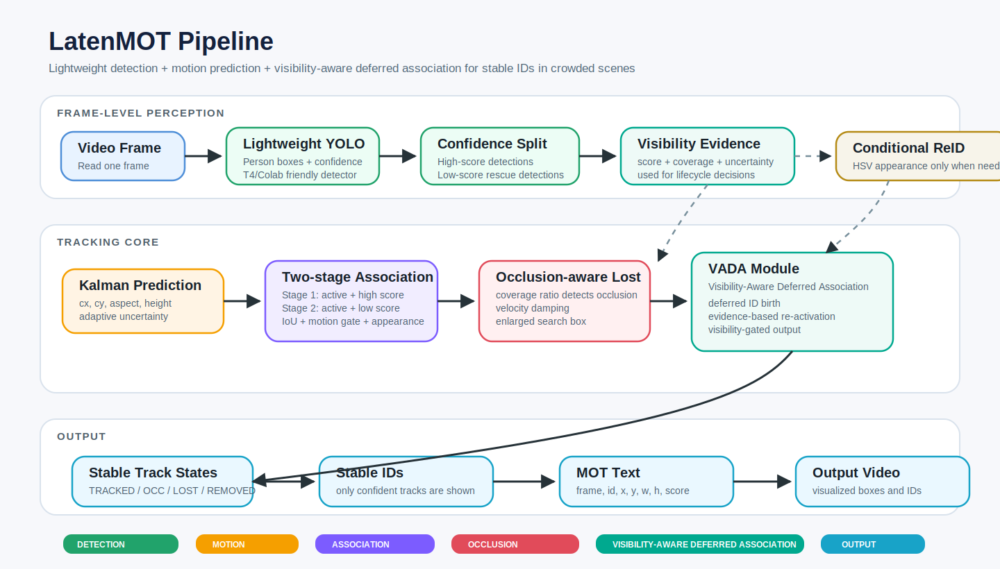

# LatenMOT

Pipeline MOT nhẹ:

`Lightweight Detection -> Motion Prediction -> Two-stage Association -> Lost Track Re-activation -> Conditional ReID -> Stable ID`



Checkpoint detector đã có trong thư mục:

```text
best_crossval_v11_non_early_stop (1).pt
```

## Chạy trên Kaggle hoặc Colab

```python
!pip install -q -r requirements.txt
```

```python
!python latenmot_tracker.py \
  --weights "best_crossval_v11_non_early_stop (1).pt" \
  --source "/kaggle/input/your-video/video.mp4" \
  --output "/kaggle/working/latenmot_output.mp4" \
  --save-mot "/kaggle/working/latenmot_tracks.txt" \
  --device 0 \
  --imgsz 640 \
  --person-class 0
```

Trên Colab, thay `--source` bằng đường dẫn video trong `/content/...` và `--output` bằng `/content/latenmot_output.mp4`.

Ví dụ Colab với Google Drive:

```python
from google.colab import drive
drive.mount("/content/drive")
```

```python
%cd /content
!git clone https://github.com/khangkaka066/LatenMOT.git || true
%cd /content/LatenMOT
!git pull
!pip install -q -r requirements.txt
```

```python
!python latenmot_tracker.py \
  --weights "/content/drive/MyDrive/best_crossval_v11_non_early_stop(1).pt" \
  --source "/content/drive/MyDrive/test_video.mp4" \
  --output "/content/drive/MyDrive/latenmot_output.mp4" \
  --save-mot "/content/drive/MyDrive/latenmot_tracks.txt" \
  --device 0 \
  --imgsz 640 \
  --det-iou 0.85 \
  --max-det 1000 \
  --person-class 0
```

Nếu `VideoWriter` vẫn lỗi trên Drive, hãy xuất tạm vào `/content/latenmot_output.mp4`, sau đó tải file về hoặc copy sang Drive.

Nếu video có đám đông, dùng preset nhạy hơn:

```python
!python latenmot_tracker.py \
  --weights "/content/drive/MyDrive/best_crossval_v11_non_early_stop(1).pt" \
  --source "/content/drive/MyDrive/test_video.mp4" \
  --output "/content/latenmot_output.mp4" \
  --save-mot "/content/latenmot_tracks.txt" \
  --device 0 \
  --imgsz 960 \
  --det-iou 0.9 \
  --max-det 1500 \
  --track-high-thresh 0.35 \
  --track-low-thresh 0.03 \
  --new-track-thresh 0.45 \
  --stage1-min-iou 0.12 \
  --stage2-min-iou 0.05 \
  --track-buffer 90 \
  --draw-lost-frames 20 \
  --motion-gate 24 \
  --lost-motion-gate 50 \
  --motion-lambda 0.1 \
  --occlusion-coverage-thresh 0.4 \
  --occlusion-velocity-damping 0.5 \
  --occlusion-reset-alpha 0.1 \
  --occlusion-box-enlarge 1.3 \
  --person-class 0
```

Preset thử nghiệm cho hướng paper `Visibility-Aware Deferred Association`:

```python
!python latenmot_tracker.py \
  --weights "/content/drive/MyDrive/best_crossval_v11_non_early_stop(1).pt" \
  --source "/content/drive/MyDrive/test_video.mp4" \
  --output "/content/latenmot_output_vada.mp4" \
  --save-mot "/content/latenmot_tracks_vada.txt" \
  --device 0 \
  --imgsz 960 \
  --det-iou 0.82 \
  --max-det 1000 \
  --track-high-thresh 0.45 \
  --track-low-thresh 0.08 \
  --new-track-thresh 0.58 \
  --stage1-min-iou 0.16 \
  --stage2-min-iou 0.08 \
  --track-buffer 70 \
  --draw-lost-frames 8 \
  --motion-gate 20 \
  --lost-motion-gate 42 \
  --motion-lambda 0.12 \
  --occlusion-coverage-thresh 0.55 \
  --occlusion-velocity-damping 0.6 \
  --occlusion-reset-alpha 0.07 \
  --occlusion-box-enlarge 1.18 \
  --pending-confirm-hits 3 \
  --pending-max-misses 2 \
  --output-visibility-thresh 0.2 \
  --lost-output-visibility-thresh 0.28 \
  --reactivation-evidence-thresh 0.95 \
  --person-class 0
```

## Ý tưởng chính

- YOLO/Ultralytics load trực tiếp trọng số `.pt` để detect người.
- Kalman filter dự đoán chuyển động khi object bị che/mất detection ngắn hạn.
- Association stage 1 nối track đang active với detection confidence cao.
- Association stage 2 dùng detection confidence thấp hơn để cứu track đang active.
- Lost track được giữ trong `--track-buffer` frame, thử re-activate trước khi cấp ID mới.
- Conditional ReID dùng color-hist appearance embedding nhẹ, chỉ kích hoạt khi cần nối lost track hoặc cập nhật gallery cho track đã match.
- Với cảnh đông, `--det-iou` cao và `--max-det` lớn giúp YOLO giữ lại nhiều box chồng nhau hơn sau NMS.
- Kalman dùng adaptive uncertainty, confidence-aware update và Mahalanobis motion gating để giảm nối nhầm ID.
- Occlusion-aware Kalman phát hiện track bị che bằng coverage ratio, giảm velocity, reset mềm về vị trí quan sát cuối và nới box tìm kiếm khi re-activate.
- Visibility-Aware Deferred Association trì hoãn ID mới và re-activation yếu cho đến khi có đủ bằng chứng qua nhiều frame.
